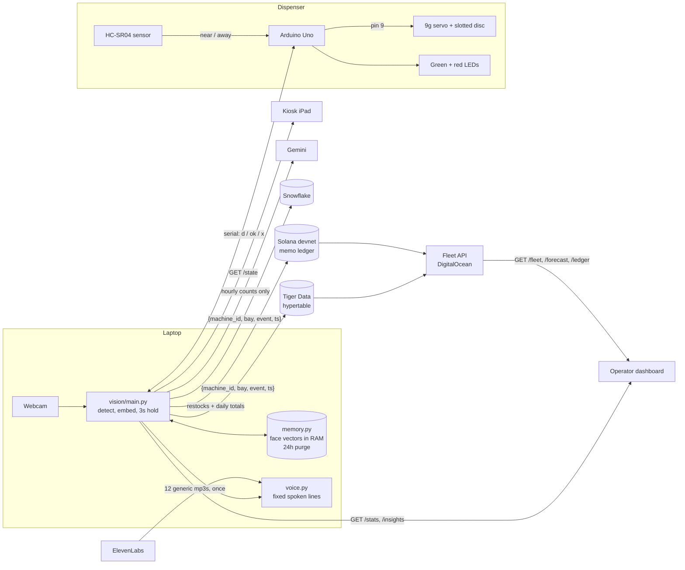

# Dispenserve

**A free snack dispenser for college students: one item per person per day, and it never learns who anyone is.**

Walk up and the kiosk wakes. Look at the camera for 3 seconds. If you haven't had one today, a servo turns a slotted disc, your item drops, the green light blinks and a friendly voice says "here you go." If you have, the red light comes on and the kiosk tells you to come back tomorrow. Walk away and it goes back to sleep.

Behind that: your face becomes an anonymous vector that lives **only in the laptop's RAM** for 24 hours. Staff see stock levels and restock advice, donors see every restock on a public ledger, and not one of those systems ever receives anything about a person.

## Privacy architecture

- **Face vectors live in memory only.** One 512-number vector per person, never written to disk, never sent anywhere. See [PRIVACY.md](PRIVACY.md) for exactly what every service receives.
- **24 hour purge.** Old entries are dropped before every scan and overwritten with zeros. Quitting the app erases everything.
- **Asleep until someone is there.** An ultrasonic sensor wakes the machine. While asleep, camera frames aren't even run through face detection.
- **Fails open.** If matching throws an error, the person gets the item.
- **Only counts and fixed text leave the laptop.** Telemetry is `{machine_id, bay, event, ts}`. The Solana ledger holds restock and daily totals. Gemini sees hourly counts. ElevenLabs sees the twelve fixed kiosk lines.
- **Enforced by tests.** `tests/test_privacy.py` runs a full session under Python audit hooks and fails on any file write or off-machine connection. Every integration has its own test proving what it sends.

## Architecture



## Hardware

- Laptop (developed on an Apple Silicon Mac) and a USB webcam (the built-in camera works too)
- Arduino Uno + USB-B **data** cable
- 9V battery with a barrel-jack plug
- SG90 9g micro servo + a slotted disc on the horn
- HC-SR04 ultrasonic sensor, on the front panel facing out
- Green LED, red LED, two 220Ω resistors
- Jumper wires, small breadboard
- iPad or any tablet for the kiosk

## Wiring

| Part | Pin | Arduino |
|---|---|---|
| 9V battery | barrel plug | barrel jack |
| Servo signal (orange/yellow) | | **pin 9** |
| Servo power (red) | | **5V** |
| Servo ground (brown) | | **GND** |
| HC-SR04 | VCC / GND | 5V / GND |
| HC-SR04 | TRIG | **pin 3** |
| HC-SR04 | ECHO | **pin 4** |
| Green LED | long leg through 220Ω | **pin 6**, short leg to GND |
| Red LED | long leg through 220Ω | **pin 7**, short leg to GND |

The servo is only attached (driven) while it sweeps, so it draws no holding current while idle. The Arduino's 5V regulator is still feeding a motor, though: in one of three 10-dispense test runs, the board froze after the third sweep. The sketch now has a watchdog that resets it within 2 seconds if that happens. If you see repeated "jam" alerts, the 9V battery is sagging: replace it, or give the servo its own 4×AA pack (shared ground).

Plug the Uno straight into the laptop. Some USB hubs power the board (green light on) but don't pass data.

## Running it

### Setup

```bash
python3 -m venv .venv
.venv/bin/pip install -r requirements.txt
cp .env.example .env     # then fill in keys, see SETUP_KEYS.md. Everything is optional.
```

The face model (~280 MB, `buffalo_l`) downloads to `~/.insightface` on first run.

### Arduino

```bash
brew install arduino-cli
arduino-cli core install arduino:avr && arduino-cli lib install Servo
arduino-cli compile --fqbn arduino:avr:uno dispenser
arduino-cli upload --fqbn arduino:avr:uno -p /dev/cu.usbmodem1301 dispenser   # your port may differ
.venv/bin/python vision/test_serial.py   # press Enter to test a sweep
```

On Apple Silicon, the AVR compiler needs Rosetta: `softwareupdate --install-rosetta --agree-to-license`.

Serial protocol (9600 baud): the board prints `ready` on boot, then `nosensor` if the ultrasonic sensor never echoes. `d` → sweep, green blinks → `ok` (~4.9 s). `x` → red LED for 3 s. It sends `near` / `away` on its own.

### The machine

```bash
.venv/bin/python vision/main.py                  # webcam + arduino + every integration that has a key
.venv/bin/python vision/main.py --camera 0       # built-in camera
.venv/bin/python vision/main.py --no-camera      # fake scan every 10s, for demos without a camera
```

| Flag | Effect |
|---|---|
| `--no-serial` / `--no-sensor` | no Arduino / ignore the sensor and stay awake |
| `--liveness` | reject photo spoofs (default: log the score only) |
| `--no-tiger` / `--no-snowflake` | don't send telemetry there |
| `--no-solana` | don't write the donor ledger |
| `--no-gemini` | rule-based restock insight only |
| `--no-elevenlabs` / `--mute` | macOS `say` voice / no voice |
| `--flush-solana` | ask the running app to write today's total to Solana now |

Keys (camera window, or type + Enter with `--no-camera`): `f` force dispense, `c` clear memory, `r` restock (logs to Solana), `q` quit.

Open the kiosk on the iPad at `http://<laptop-ip>:8000/kiosk.html` and the operator dashboard at `http://<laptop-ip>:8000/dashboard.html?fleet=<fleet-api-url>`.

| Endpoint | Returns |
|---|---|
| `GET /state` | `{state: sleep\|idle\|scanning\|dispensed\|already_served, progress: 0-1, item}` |
| `GET /stats` | `{bays: [{name, remaining, capacity}], dispensed_today, unique_today, jam}` |
| `GET /insights` | `{text, source: gemini\|rules, generated_at}`: 2 sentence restock advice, cached 10 min |

**About the Gemini insight.** The first call answers instantly with the rule-based estimate (`"source": "rules"`) while Gemini is asked on a background thread; the text switches to Gemini's about 10-15 seconds later and is then cached for 10 minutes, so the demo never waits on it. A failed call is retried once after 2 seconds before falling back to the estimate, and the request timeout is 30s, which is enough on a phone hotspot. Leave `GEMINI_MODEL` unset: the default `gemini-flash-latest` works, while `gemini-2.5-flash` returns 404 for new keys ("no longer available to new users").
| `GET /metrics` | avg / p50 / p95 ms per stage: detect, landmarks, embed, liveness, average, decide, serial |

### Donor ledger (Solana devnet)

```bash
.venv/bin/python vision/ledger.py --new-keypair ~/.config/dispenserve/devnet.json
# add SOLANA_KEYPAIR_PATH=~/.config/dispenserve/devnet.json to .env
.venv/bin/python vision/ledger.py --airdrop      # 1 free devnet SOL; if rate-limited, use https://faucet.solana.com
.venv/bin/python vision/ledger.py --balance      # prints the address; put it in SOLANA_LEDGER_ADDRESSES for the fleet API
```

With the Solana CLI instead: `solana-keygen new -o ~/.config/dispenserve/devnet.json` and `solana airdrop 1 <address> --url devnet`.

### Fleet API (Tiger Data + DigitalOcean)

```bash
psql "$TIGER_DATABASE_URL" -f cloud/schema.sql       # hypertable, hourly continuous aggregate, retention
cd cloud/api && ../../.venv/bin/python app.py --fake  # generated data for 3 machines on :8080
doctl apps create --spec .do/app.yaml                # deploy; then set TIGER_DATABASE_URL + SOLANA_LEDGER_ADDRESSES
```

| Endpoint | Returns |
|---|---|
| `GET /fleet` | every machine: `last_seen`, `online`, `dispensed_today`, `bays: [{name, remaining, capacity, ...}]` |
| `GET /forecast` | per bay: `rate_per_hour`, `hours_left`, `runs_out_at`, `status: ok\|low\|empty\|idle` |
| `GET /ledger` | recent restock and daily-total records from devnet, each with an explorer link |

Snowflake: run `cloud/snowflake_schema.sql` in a worksheet (table + `DAILY_BAY_SUMMARY` view).

### Tools and tests

```bash
.venv/bin/python vision/tune.py --demo     # threshold report on synthetic scores (live mode: label real scans)
.venv/bin/python vision/focus_test.py      # webcam sharpness check
.venv/bin/pytest                           # the whole suite, no hardware or keys needed
```

## Environment variables

All optional; see `.env.example` and [SETUP_KEYS.md](SETUP_KEYS.md). Missing keys are logged at startup and that feature falls back or turns off.

| Variable | Used by | Without it |
|---|---|---|
| `MACHINE_ID`, `BAY_NAME`, `BAY_CAPACITY` | machine | `dispenserve-1`, `Kit Kat`, `24` |
| `TIGER_DATABASE_URL` | machine, fleet API | telemetry is only logged; the API serves demo data |
| `SNOWFLAKE_ACCOUNT` `_USER` `_PASSWORD` `_WAREHOUSE` `_DATABASE` `_SCHEMA` | machine | no Snowflake |
| `SOLANA_KEYPAIR_PATH` | machine | no donor ledger |
| `SOLANA_LEDGER_ADDRESSES` | fleet API | `/ledger` shows example records |
| `GEMINI_API_KEY` (`GEMINI_MODEL`) | machine | rule-based run-out estimate |
| `ELEVENLABS_API_KEY` (`ELEVENLABS_VOICE_ID`) | machine | macOS `say` |
| `FLEET_FAKE`, `FLEET_TZ`, `FORECAST_WINDOW_HOURS` | fleet API | real data if a DB is set, UTC, 3 |

## Layout

```
dispenser/   Arduino sketch: servo, sensor, LEDs, watchdog
vision/      the machine: camera loop, memory, liveness, serial, kiosk server,
             telemetry + sinks/ (Tiger Data, Snowflake), ledger (Solana), insights (Gemini), voice (ElevenLabs)
cloud/       Tiger Data + Snowflake schemas, fleet API (FastAPI, Docker, DigitalOcean)
ui/          kiosk and operator dashboard
tests/       pytest suite, including the privacy tests
```
