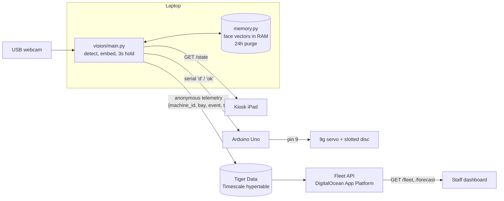

# dispenserve

A snack dispenser that gives **one item per person per day**, without knowing who anyone is.

Step up to the kiosk and hold still for 3 seconds. A laptop camera turns your face into an anonymous vector and checks it against everyone served in the last 24 hours. If you're new, an Arduino-driven servo turns a slotted disc and drops your item. If you've already had one today, the kiosk says so. Vectors live only in RAM and are purged after 24 hours. The only thing that ever leaves the machine is an anonymous count: *machine X dispensed one Kit Kat at 14:03*. Campus staff can see every machine's stock and when each bay will run out.

## Privacy architecture

- **Face vectors live in memory only.** Nothing is written to disk and there is no database of people. See [PRIVACY.md](PRIVACY.md).
- **24 hour purge.** Entries older than 24h are dropped before every scan and overwritten with zeros. Quitting the app erases everything.
- **Fails open.** If matching throws an error, the person gets the item. A bug should never cost someone their snack.
- **Only anonymous counts leave the machine**: `{machine_id, bay, event, ts}`, nothing else.
- **Enforced by tests.** `tests/test_privacy.py` runs a full session under Python audit hooks and fails on any file write or off-machine connection.

## Architecture



## Hardware

- Laptop (developed on an Apple Silicon Mac)
- USB webcam (the built-in camera works as a fallback)
- Arduino Uno + USB-B **data** cable
- SG90 9g micro servo
- 4×AA battery pack (≈6V) to power the servo
- Slotted disc to hold the items, mounted on the servo horn
- Jumper wires, and optionally a small breadboard
- iPad or any tablet for the kiosk screen

## Wiring

| From | To |
|---|---|
| Servo signal (orange/yellow) | Arduino **pin 9** |
| Servo ground (brown) | Arduino **GND** |
| Battery pack black (−) | Arduino **GND** (same pin via a breadboard row, or a second GND pin) |
| Battery pack red (+) | Servo power (red) **only** |

The servo is powered by the batteries, not the Arduino. On USB power alone the servo's current draw browns out the Uno and it resets mid-sweep. The two grounds must be connected so the signal on pin 9 has a common reference. The battery's red wire must never touch the Arduino.

Plug the Uno straight into the laptop. Some USB hubs power the board (green light on) but don't pass its data through.

## Running it

### 1. Setup

```bash
python3 -m venv .venv
.venv/bin/pip install -r requirements.txt
```

The face model (~280 MB, `buffalo_l`) downloads to `~/.insightface` on first run.

### 2. Arduino

```bash
brew install arduino-cli
arduino-cli core install arduino:avr && arduino-cli lib install Servo
arduino-cli compile --fqbn arduino:avr:uno dispenser
arduino-cli upload --fqbn arduino:avr:uno -p /dev/cu.usbmodem101 dispenser   # your port may differ
.venv/bin/python vision/test_serial.py   # press Enter to test a sweep
```

On Apple Silicon, the AVR compiler needs Rosetta: `softwareupdate --install-rosetta --agree-to-license`.

### 3. The machine

```bash
.venv/bin/python vision/main.py                  # webcam + arduino
.venv/bin/python vision/main.py --no-camera      # fake scan every 10s, no hardware needed
.venv/bin/python vision/main.py --liveness       # reject photo spoofs (default: log the score only)
```

Open the kiosk on the iPad at `http://<laptop-ip>:8000/kiosk.html` and the local dashboard at `/dashboard.html`. Keys: `f` force dispense, `c` clear memory, `r` restock, `q` quit. With `--no-camera`, type the key and press Enter in the terminal.

| Endpoint | Returns |
|---|---|
| `GET /state` | `{state: idle\|scanning\|dispensed\|already_served, progress: 0-1, item}` |
| `GET /stats` | `{bays: [{name, remaining, capacity}], dispensed_today, unique_today}` |
| `GET /metrics` | avg / p50 / p95 ms for detect, landmarks, embed, liveness, average, decide, serial |

### 4. Tools

```bash
.venv/bin/python vision/tune.py --demo     # threshold report on synthetic scores
.venv/bin/python vision/tune.py            # live: label real scans y/n, get false match / missed match rates
.venv/bin/python vision/focus_test.py      # webcam sharpness check
.venv/bin/pytest                           # tests
```

### 5. Fleet (Tiger Data + DigitalOcean)

```bash
psql "$TIGER_DATABASE_URL" -f cloud/schema.sql      # hypertable, hourly continuous aggregate, retention
cd cloud/api && ../../.venv/bin/python app.py --fake # generated data for 3 machines on :8080
doctl apps create --spec .do/app.yaml               # deploy; then set TIGER_DATABASE_URL as a secret
```

| Endpoint | Returns |
|---|---|
| `GET /fleet` | every machine: `last_seen`, `online`, `dispensed_today`, `bays: [{name, remaining, capacity, dispensed_today, last_restocked}]` |
| `GET /forecast` | per bay: `rate_per_hour` over the last 3 full hours, `hours_left = remaining / rate`, `runs_out_at`, `status: ok\|low\|empty\|idle` |

Without a database URL, the API serves generated data and reports `"source": "fake"`.

## Environment variables

Put these in a `.env` file at the repo root (it's gitignored). All are optional.

| Variable | Used by | Default | Meaning |
|---|---|---|---|
| `TIGER_DATABASE_URL` | machine, fleet API | unset | Tiger Data / Timescale Postgres URL. Unset: the machine only logs telemetry and the API serves fake data |
| `MACHINE_ID` | machine | `dispenserve-1` | Name for this machine in the fleet |
| `BAY_NAME` | machine | `Kit Kat` | Item in the bay |
| `BAY_CAPACITY` | machine, fleet API | `24` | Items when full |
| `FLEET_FAKE` | fleet API | unset | `1` forces generated data |
| `FLEET_TZ` | fleet API | `UTC` | Timezone for "today", e.g. `America/New_York` |
| `FORECAST_WINDOW_HOURS` | fleet API | `3` | Hours of history behind the dispense rate |

## Layout

```
dispenser/   Arduino sketch (servo on pin 9, 'd' → sweep → "ok")
vision/      the machine: camera loop, memory, liveness, serial, kiosk server, telemetry
cloud/       Tiger Data schema and the fleet API (FastAPI, Docker, DigitalOcean)
ui/          kiosk and dashboard pages
tests/       pytest suite, including the privacy test
```
